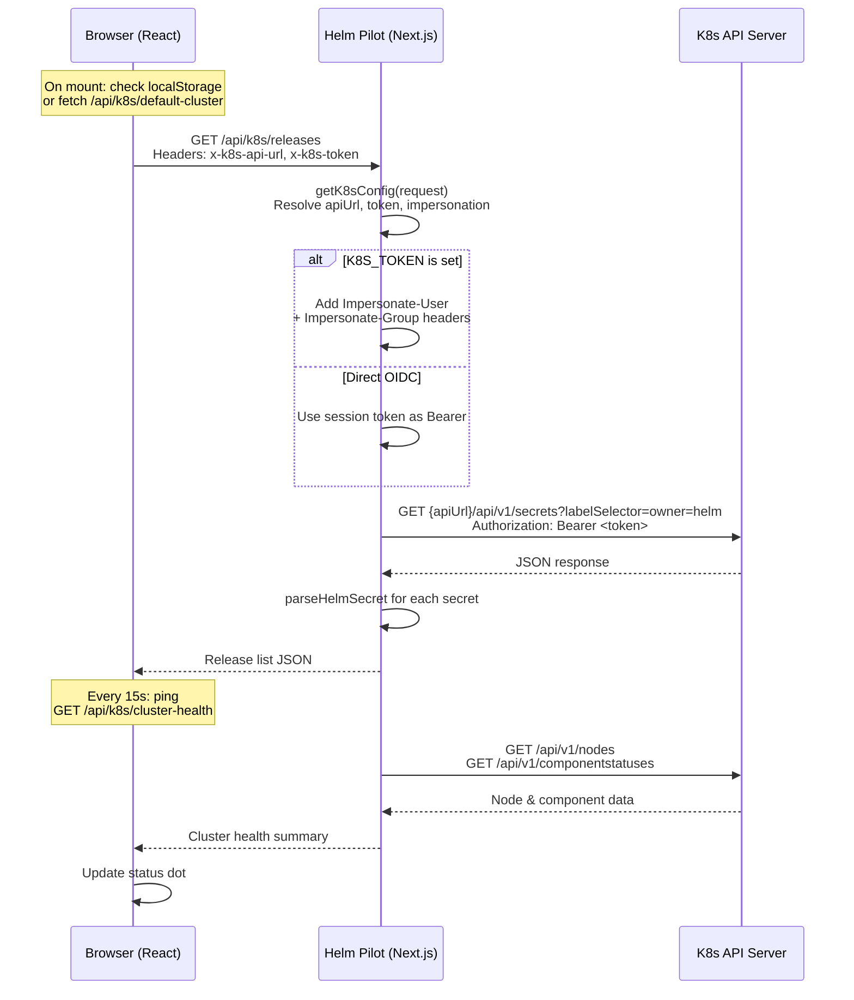

# Cluster Connection

Helm Pilot supports two methods for connecting to Kubernetes clusters: a statically configured default via environment variables, and a dynamic, user-driven cluster selector stored in the browser's `localStorage`. Both paths use the same underlying authentication and request mechanisms.

---

## Connection Methods

### Method 1: Environment Variables (Default Cluster)

When the `K8S_API_URL` environment variable is set, Helm Pilot exposes a single default cluster that does not require the UI cluster selector. This is the simplest setup for single-cluster deployments.

**Required variables:**

```bash
K8S_API_URL="https://10.100.0.1:6443"
K8S_CLUSTER_NAME="Production"            # optional, defaults to "Default Cluster"
```

The endpoint `/api/k8s/default-cluster` returns a JSON object with the cluster metadata:

```json
{
  "id": "default",
  "name": "Production",
  "apiUrl": "https://10.100.0.1:6443"
}
```

If `K8S_API_URL` is not set, the endpoint returns `null`, and the frontend falls back to the UI cluster selector.

**How it's detected on startup:** In `AppContext.tsx`, when the application mounts, it checks `localStorage` for saved clusters. If none are found and no active cluster is configured, it fetches `/api/k8s/default-cluster`. If a default cluster exists, it becomes the active cluster automatically.

### Method 2: UI Cluster Selector

Users can add, select, and remove clusters through the `ClusterSelector` component. Each cluster profile is stored in `localStorage` under two keys:

| Key | Value |
|---|---|
| `helm_manager_clusters` | A JSON array of `K8sCluster` objects |
| `helm_manager_active_cluster_id` | The `id` of the currently active cluster |

The `K8sCluster` interface:

```typescript
interface K8sCluster {
  id: string;        // crypto.randomUUID()
  name: string;      // human-readable nickname (e.g. "Production GKE")
  apiUrl: string;    // K8s API server URL
  token?: string;    // optional bearer token override
  caCert?: string;   // optional CA certificate for TLS
}
```

When a user selects a cluster, the frontend sends the cluster's `apiUrl` (and optionally `token` and `caCert`) as request headers on every K8s API call. The backend reads these headers and uses them to construct the K8s API request, falling back to environment variables when headers are absent.

**Adding a cluster:** The "Add Cluster" form collects a nickname (`name`) and API server URL (`apiUrl`). A "Test Connection" button calls `/api/k8s/test` to validate connectivity before saving.

**Removing a cluster:** Removes the profile from `localStorage`. If the active cluster is removed, the active selection is cleared.

---

## Default Cluster Auto-Detection

The auto-detection flow runs at application startup:

1. `AppContext` reads `localStorage` for saved clusters and an active cluster ID.
2. If no saved clusters exist and no active cluster is found, it fetches `/api/k8s/default-cluster`.
3. If the endpoint returns a cluster object (because `K8S_API_URL` is set), it becomes the active cluster.
4. If the endpoint returns `null`, the user sees an empty state and is prompted to add a cluster via the UI.

This means:
- **Single-cluster deployments** can skip the UI entirely. Helm Pilot is ready to use immediately after login.
- **Multi-cluster deployments** can either start with a default and add more, or add all clusters through the UI.

---

## Authentication

### Direct OIDC Token Mode (default)

When `K8S_TOKEN` is **not** set, every K8s API request is authorized with the user's OIDC access token. The flow:

1. The user logs in via OIDC. Their `access_token` is stored in the encrypted `helm_session` cookie.
2. On every K8s API request, the backend reads the session cookie, extracts the token, and passes it as a `Bearer` token in the `Authorization` header to the K8s API.
3. The K8s API server validates the token against the OIDC provider (or its own configured JWT authenticator) and authorizes the request based on the user's RBAC bindings.

**Header construction** (from `getK8sConfig` in `src/lib/k8s.ts`):

```typescript
const headerToken = request.headers.get('x-k8s-token');
const token = headerToken && headerToken !== 'undefined'
  ? headerToken
  : session?.token;
```

The token precedence is:
1. `x-k8s-token` header from the browser (for multi-cluster profiles with distinct tokens)
2. OIDC session token from the `helm_session` cookie

If neither is available, the request returns a 401: `Kubernetes Cluster Authentication is required.`

### Service Account Impersonation Mode

When `K8S_TOKEN` is set, the server uses that token to authenticate **itself** to the K8s API and adds impersonation headers to act on behalf of the logged-in user. See [impersonation.md](./impersonation.md) for full details.

---

## TLS Certificate Handling

### Self-Signed Certificates

Development clusters and on-premise setups often use self-signed TLS certificates. Helm Pilot handles this via the `OIDC_SKIP_TLS_VERIFY` environment variable:

```bash
OIDC_SKIP_TLS_VERIFY=true
```

This sets `NODE_TLS_REJECT_UNAUTHORIZED=0` in the Node.js process, which disables TLS certificate verification for **all** outgoing HTTPS requests — both OIDC provider calls and K8s API calls.

**Implementation** (from `src/lib/k8s.ts`, lines 6-8):

```typescript
if (process.env.OIDC_SKIP_TLS_VERIFY === 'true') {
  process.env.NODE_TLS_REJECT_UNAUTHORIZED = '0';
}
```

> **Warning:** Disabling TLS verification is a security risk. Only use this in development or air-gapped environments. For production, configure proper CA certificates via the `x-k8s-ca-cert` header.

### Custom CA Certificates

When adding a cluster via the UI, users can optionally provide a CA certificate (`caCert`). The backend does not currently implement custom CA validation per-request; the `caCert` field is stored for future use and passed through headers.

---

## K8s API Calls

### The `callK8sApi` Function

All Kubernetes API interactions go through `callK8sApi` in `src/lib/k8s.ts`. It takes a config object and a path, constructs a fully qualified URL (`apiUrl + path`), and makes a `fetch` request with appropriate headers.

**Signature:**

```typescript
async function callK8sApi(
  config: {
    apiUrl: string;
    token: string;
    caCert?: string;
    impersonateUser?: string;
    impersonateGroups?: string[];
  },
  path: string,
  options?: RequestInit
): Promise<any>
```

**Direct auth header construction:**

```typescript
const headers: Record<string, string> = {
  Authorization: `Bearer ${config.token}`,
  'Content-Type': 'application/json',
  ...Object.fromEntries(
    Object.entries(options.headers || {}).map(([k, v]) => [k, String(v)])
  ),
};
```

**Impersonation header construction:**

When `impersonateUser` is present, the function uses an **array of header tuples** instead of a plain object. This is necessary because Node's `fetch` merges headers with the same name when using a plain object. With an array, each tuple is a distinct header entry:

```typescript
const headers: [string, string][] = [
  ['Authorization', `Bearer ${config.token}`],
  ['Content-Type', 'application/json'],
  ['Impersonate-User', config.impersonateUser],
];
if (config.impersonateGroups?.length) {
  // Only the first group is sent due to Node fetch merging same-name headers
  headers.push(['Impersonate-Group', config.impersonateGroups[0]]);
}
```

**Error handling:** Any non-2xx response throws an `Error` with the status code and response body:

```typescript
if (!res.ok)
  throw new Error(`Kubernetes API error ${res.status}: ${await res.text()}`);
```

---

## Test Connection

The `/api/k8s/test` endpoint validates connectivity to a cluster. It accepts connection parameters as headers:

| Header | Required | Description |
|---|---|---|
| `x-k8s-api-url` | Yes | API server URL to test |
| `x-k8s-ca-cert` | No | CA certificate |

On success, it returns a list of accessible namespaces:

```json
{
  "success": true,
  "namespaces": ["default", "kube-system", "production", "staging"]
}
```

The "Test Connection" button in the `ClusterSelector` calls this endpoint before adding a cluster, giving the user immediate feedback.

---

## Cluster Selector UI

The `ClusterSelector` component provides the following capabilities:

### Active Cluster Display
A button showing the current cluster name with an animated status indicator:
- **Green pulsing dot** — Healthy (API latency < 120ms)
- **Amber pulsing dot** — Degraded latency (≥ 120ms)
- **Red pulsing dot** — Offline / unreachable
- **Grey dot** — Checking connectivity

### Dropdown Menu
The dropdown shows:
1. **Default cluster** from env vars (always displayed when configured)
2. **Saved clusters** from `localStorage` with select/remove controls
3. **Add Cluster** form

### Connection Status Footer
At the bottom of the dropdown, a status bar shows:
- **API Status** label with colored indicator
- **Latency** in milliseconds
- **Last refreshed** timestamp
- **Manual refresh** button

### Automatic Health Polling

The cluster selector polls `/api/k8s/cluster-health` every 15 seconds to update the connection status. The polling starts on mount and re-triggers when the active cluster changes.

**Cluster health check flow:**
1. Send `GET /api/k8s/cluster-health` with `x-k8s-api-url` and optional `x-k8s-token` headers
2. The backend calls the K8s API for node inventory and component statuses
3. The response includes total/ready/not-ready node counts, control plane status, and server-reported latency
4. The frontend compares API round-trip time to a 120ms threshold to determine health status

---

## Architecture Diagram



---

## Troubleshooting

### "Kubernetes Cluster Authentication is required" (401)

- Ensure the user is logged in (the `helm_session` cookie is present and valid).
- If using the UI cluster selector, verify the cluster's `apiUrl` is correct.
- If using env vars, check that `K8S_API_URL` is set.

### "Kubernetes API error 403"

- The authenticated user or service account lacks permissions for the requested operation.
- Check the K8s RBAC configuration. See [Authentication > RBAC](../authentication/rbac.md).
- In impersonation mode, verify the SA has the `impersonate` verb on `users` and `groups`.

### TLS / Certificate Errors

- For self-signed certs, set `OIDC_SKIP_TLS_VERIFY=true`.
- For private CAs, ensure the CA certificate is correctly configured (future enhancement).
- Verify the API URL uses `https://` (not `http://`).

### Cluster Health Shows "Offline"

- Verify the API server is reachable from the Helm Pilot process (network/firewall).
- Try the "Test Connection" button in the cluster selector.
- Check the Helm Pilot server logs for more detailed error messages.
