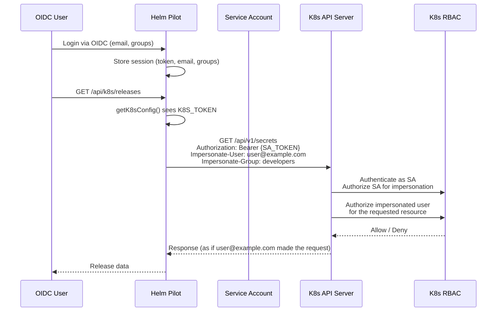

# Kubernetes Impersonation

Helm Pilot supports Kubernetes [user impersonation](https://kubernetes.io/docs/reference/access-authn-authz/authentication/#user-impersonation) as an alternative to direct OIDC token authentication. When enabled, the server authenticates to the K8s API as a privileged service account and adds impersonation headers to act on behalf of the logged-in OIDC user.

---

## When to Use Impersonation

Impersonation is useful in these scenarios:

| Scenario | Why Impersonation Helps |
|---|---|
| **K8s API doesn't trust the OIDC provider** | The cluster has no OIDC JWT authenticator configured. Impersonation lets a service account bridge the gap. |
| **Granular per-user RBAC without OIDC integration** | Use K8s RBAC to control what each user can do, without configuring the K8s API server for OIDC. |
| **Shared clusters with external IdP** | Users authenticate via a central OIDC provider, but each K8s cluster only trusts the service account. |
| **Air-gapped or restricted networks** | The K8s API server cannot reach the OIDC issuer to validate tokens directly. |
| **Audit trail** | K8s audit logs show the impersonated user's identity, not the service account's, making it clear who performed each action. |

When to use **direct OIDC** instead:

- The K8s API server is already configured with an OIDC authenticator (`--oidc-issuer-url`, `--oidc-client-id`, etc.).
- You want to minimize the privileges of the Helm Pilot service account.
- You don't want the added complexity of managing service account tokens.

---

## How Impersonation Works

### Trigger Condition

Impersonation mode is triggered when the `K8S_TOKEN` environment variable is set:

```bash
K8S_TOKEN="eyJhbGciOiJSUzI1NiIsImtpZCI6..."
```

When `K8S_TOKEN` is present, `getK8sConfig` (in `src/lib/k8s.ts`) returns a config object that includes impersonation fields:

```typescript
if (process.env.K8S_TOKEN) {
  return {
    apiUrl,
    token: process.env.K8S_TOKEN,       // SA token for server auth
    caCert,
    impersonateUser: session?.email,     // OIDC user's email
    impersonateGroups: session?.groups,  // OIDC user's groups
  };
}
```

Without `K8S_TOKEN`, the config only contains the OIDC user's access token — direct authentication mode.

### Request Flow



### Header Construction

When impersonation is active, `callK8sApi` constructs headers as an **array of tuples** rather than a plain object. This is critical because Node's `fetch` implementation merges headers with the same name when using a `Record<string, string>`:

```typescript
// CORRECT: uses array of tuples to avoid header merging
const headers: [string, string][] = [
  ['Authorization', `Bearer ${config.token}`],
  ['Content-Type', 'application/json'],
  ['Impersonate-User', config.impersonateUser],
];
if (config.impersonateGroups?.length) {
  headers.push(['Impersonate-Group', config.impersonateGroups[0]]);
}
```

The K8s API server receives three critical headers:

| Header | Value | Purpose |
|---|---|---|
| `Authorization` | `Bearer {SA_TOKEN}` | Authenticates the **service account** to the API server |
| `Impersonate-User` | `user@example.com` | Tells the API server to act as this user |
| `Impersonate-Group` | `developers` | Tells the API server to add this group to the impersonated user |

---

## Service Account Setup

### Step 1: Create a Service Account

```yaml
apiVersion: v1
kind: ServiceAccount
metadata:
  name: helm-pilot
  namespace: helm-pilot
```

### Step 2: Create a ClusterRole with Impersonation Permissions

The service account needs the `impersonate` verb on `users`, `groups`, and `serviceaccounts` resources:

```yaml
apiVersion: rbac.authorization.k8s.io/v1
kind: ClusterRole
metadata:
  name: helm-pilot-impersonator
rules:
  - apiGroups: [""]
    resources: ["users", "groups", "serviceaccounts"]
    verbs: ["impersonate"]
```

### Step 3: Bind the ClusterRole to the Service Account

```yaml
apiVersion: rbac.authorization.k8s.io/v1
kind: ClusterRoleBinding
metadata:
  name: helm-pilot-impersonator
roleRef:
  apiGroup: rbac.authorization.k8s.io
  kind: ClusterRole
  name: helm-pilot-impersonator
subjects:
  - kind: ServiceAccount
    name: helm-pilot
    namespace: helm-pilot
```

### Step 4: Get the Service Account Token

For Kubernetes 1.24+, create a token manually:

```yaml
apiVersion: v1
kind: Secret
metadata:
  name: helm-pilot-token
  namespace: helm-pilot
  annotations:
    kubernetes.io/service-account.name: helm-pilot
type: kubernetes.io/service-account-token
```

Extract the token:

```bash
kubectl get secret helm-pilot-token -n helm-pilot -o jsonpath='{.data.token}' | base64 -d
```

### Step 5: Configure Helm Pilot

Set the token in the Helm Pilot environment:

```bash
K8S_TOKEN="eyJhbGciOiJSUzI1NiIs..."
K8S_API_URL="https://10.100.0.1:6443"
```

### Step 6: Configure User RBAC

With impersonation in place, you can now create RBAC rules for actual users (by email). The K8s API server evaluates RBAC against the impersonated user, not the service account:

```yaml
# Grant alice@example.com full access to her team's namespace
apiVersion: rbac.authorization.k8s.io/v1
kind: RoleBinding
metadata:
  name: alice-team-access
  namespace: team-alice
roleRef:
  apiGroup: rbac.authorization.k8s.io
  kind: ClusterRole
  name: admin
subjects:
  - kind: User
    name: alice@example.com
    apiGroup: rbac.authorization.k8s.io
```

---

## Group Handling

### OIDC Groups in the Session

Helm Pilot stores the user's OIDC groups in the session cookie. The session interface includes an optional `groups` array:

```typescript
interface SessionUser {
  email: string;
  name: string;
  token?: string;
  groups?: string[];  // OIDC groups from the token/userinfo
}
```

These groups are extracted from the OIDC token or userinfo endpoint and passed through to the impersonation config.

### Single Group Limitation

Only the **first group** from `session.groups` is sent as an `Impersonate-Group` header. This is due to a limitation in Node's `fetch` implementation:

> Node's `fetch` merges headers with the same name when using a `Headers` object. While the code uses an array of tuples to avoid merging for the initial headers, additional `Impersonate-Group` headers would be collapsed. As a practical compromise, only the first group is sent.

```typescript
if (config.impersonateGroups?.length) {
  // Node fetch merges same-name headers, so only send first group
  headers.push(['Impersonate-Group', config.impersonateGroups[0]]);
}
```

**Workaround:** If you need multiple groups, ensure the most privileged or most commonly used group is first in the OIDC provider's group ordering.

---

## Comparison: Direct OIDC vs Impersonation

| Aspect | Direct OIDC | Impersonation (K8S_TOKEN) |
|---|---|---|
| **K8s API server config** | Requires OIDC flags (`--oidc-issuer-url`, etc.) | No special API server config needed |
| **Authentication** | User's OIDC access token | Service account token + impersonation headers |
| **RBAC subject** | OIDC claims (email, groups) mapped to K8s users | The impersonated user's name and group |
| **Token lifecycle** | Tied to OIDC token expiry (usually 1h) | SA token is long-lived; impersonation uses the OIDC user's identity |
| **Audit logs** | Show the OIDC user | Show the impersonated user |
| **Group support** | Full group list from OIDC token | Only the first group is sent |
| **Identity mapping** | Configured via OIDC prefix (`--oidc-username-claim`, `--oidc-groups-claim`) | Email is used directly as the username |
| **Network requirements** | K8s API server must reach the OIDC issuer | No network dependency on the IdP |
| **SA privileges** | Minimal (only what Helm Pilot itself needs) | Requires `impersonate` on `users` and `groups` |
| **Complexity** | Simpler setup if OIDC is already configured on the cluster | More setup, but more flexible |

---

## Debugging Impersonation

### Enable Debug Logging

Set `LOG_LEVEL=debug` in Helm Pilot's environment to see detailed impersonation information in the server logs:

```bash
LOG_LEVEL=debug
```

Debug output includes:
- Whether `K8S_TOKEN` is detected
- The impersonation user being sent
- The impersonation group being sent
- K8s API response status codes

### Verify Impersonation with curl

You can verify impersonation is working by making a direct request to the K8s API with impersonation headers, using the same SA token and user identity:

```bash
# Variables
SA_TOKEN="eyJhbGciOiJSUzI1NiIs..."
K8S_API="https://10.100.0.1:6443"
IMPERSONATE_USER="alice@example.com"
IMPERSONATE_GROUP="developers"

# Test: list pods as the impersonated user
curl -k \
  -H "Authorization: Bearer ${SA_TOKEN}" \
  -H "Impersonate-User: ${IMPERSONATE_USER}" \
  -H "Impersonate-Group: ${IMPERSONATE_GROUP}" \
  "${K8S_API}/api/v1/namespaces/default/pods"
```

A successful response means the SA has `impersonate` permissions and the impersonated user has access to the requested resource.

### Check Impersonation Permissions

Verify the service account has the required permissions:

```bash
kubectl auth can-i impersonate users --as=system:serviceaccount:helm-pilot:helm-pilot
# Expected: yes

kubectl auth can-i impersonate groups --as=system:serviceaccount:helm-pilot:helm-pilot
# Expected: yes
```

### Check User Permissions

Verify an impersonated user has access to specific resources:

```bash
kubectl auth can-i list secrets \
  --as=alice@example.com \
  --as-group=developers \
  -n default
# Expected: yes (if RBAC is configured correctly)
```

### Common Errors

| Error | Likely Cause | Solution |
|---|---|---|
| `403 Forbidden: users "alice@example.com" is forbidden` | The user has no RBAC permissions for the requested resource. | Create a RoleBinding or ClusterRoleBinding for the user. |
| `401 Unauthorized: impersonation not allowed` | The SA lacks impersonation permissions. | Verify the ClusterRole grants `impersonate` on `users` and `groups`. |
| `403 Forbidden: impersonation not allowed for user "system:serviceaccount:helm-pilot:helm-pilot"` | The SA tried to impersonate but is not authorized. | Check the ClusterRoleBinding is correctly bound. |
| `Impersonate-Group header missing` or only one group present | The Node fetch limitation. | Ensure the first group in the OIDC token is the most commonly needed one. |
| `Kubernetes Cluster Authentication is required` (401) | `K8S_TOKEN` is not set or is invalid. | Verify the token is correct and hasn't expired. |

---

## Security Considerations

### Principle of Least Privilege

The service account used for impersonation should have **only** the `impersonate` verb — no other permissions. Its sole job is to authenticate and delegate to impersonated users:

```yaml
rules:
  - apiGroups: [""]
    resources: ["users", "groups", "serviceaccounts"]
    verbs: ["impersonate"]
  # NO other rules — actual resource access is governed by the impersonated user's RBAC
```

### Token Rotation

Service account tokens should be rotated regularly. In Kubernetes 1.24+, consider using projected volume tokens with expiration:

```yaml
apiVersion: v1
kind: Pod
spec:
  serviceAccountName: helm-pilot
  volumes:
    - name: token
      projected:
        sources:
          - serviceAccountToken:
              path: token
              expirationSeconds: 7200  # 2-hour token
```

### Audit Trail Integrity

When impersonation is used, K8s audit logs record both the impersonating SA and the impersonated user:

```json
{
  "user": {
    "username": "alice@example.com",
    "groups": ["developers"]
  },
  "impersonator": {
    "username": "system:serviceaccount:helm-pilot:helm-pilot"
  }
}
```

This provides a clear audit trail showing:
- **Who** performed the action (the OIDC user)
- **Which service** facilitated it (Helm Pilot's SA)

### TLS

Always use HTTPS for the K8s API connection. If using self-signed certificates, set `OIDC_SKIP_TLS_VERIFY=true` **only** in development or air-gapped environments. For production, use proper CA-signed certificates or configure the cluster's CA via the `x-k8s-ca-cert` header.

---

## Multi-Cluster Impersonation

The `K8S_TOKEN` approach works for the default cluster. For UI-configured clusters, each cluster profile can include a `token` field in the `K8sCluster` object. However, impersonation (`Impersonate-User` + `Impersonate-Group` headers) is **only** triggered by the presence of `K8S_TOKEN` in the server environment.

If you need impersonation across multiple clusters with different service accounts, you would need to configure per-cluster service account tokens. Currently, the impersonation configuration is global (server-level), not per-cluster.

---

## Further Reading

- [Kubernetes User Impersonation](https://kubernetes.io/docs/reference/access-authn-authz/authentication/#user-impersonation) — Official Kubernetes documentation.
- [Authentication > RBAC](../authentication/rbac.md) — Helm Pilot RBAC setup with ClusterRole and ClusterRoleBinding examples.
- [Cluster Connection](./cluster-connection.md) — How Helm Pilot connects to clusters, including the direct OIDC authentication flow.
- [Getting Started > Configuration](../getting-started/configuration.md) — Full environment variable reference including `K8S_TOKEN`.
